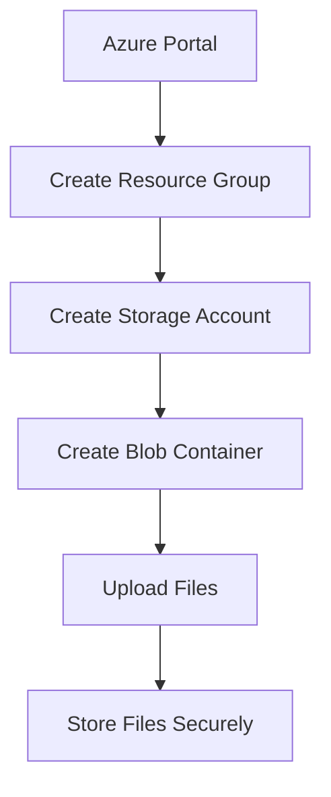

# Cloud File Storage System Using Microsoft Azure

## Overview

This project demonstrates the implementation of a Cloud File Storage System using Microsoft Azure. The system provides a secure and cost-effective way to store and manage files in the cloud. Azure Storage services are used to upload, store, and access files from anywhere through the internet.

---

## Project Description

The Cloud File Storage System is designed to provide secure cloud storage for users. The project uses Azure Resource Group, Storage Account, and Blob Storage Container to organize and manage files efficiently.

The system offers:
- Secure file storage
- Easy file upload and management
- Remote accessibility
- Reliable cloud storage
- Scalable infrastructure

---

## Azure Services Used

- Azure Resource Group
- Azure Storage Account
- Azure Blob Storage

---

## Features

- Secure cloud storage
- Easy file upload
- File management
- Remote accessibility
- Scalable solution
- Low maintenance cost

---

## Objectives

- Store files securely in the cloud.
- Provide easy file management.
- Allow remote access to stored files.
- Learn Microsoft Azure Storage services.
- Implement a simple cloud storage solution.

---

## Implementation Steps

### Step 1
Create a Resource Group.

### Step 2
Create a Storage Account.

### Step 3
Create a Blob Container.

### Step 4
Upload files.

### Step 5
Verify uploaded files.

---

## Flow Diagram

---

## Project Workflow

---

## Expected Outcome

- Resource Group created successfully.
- Storage Account configured.
- Blob Container created.
- Files uploaded successfully.
- Files securely stored.
- Files accessible anytime.

---

## Project Output

- Secure cloud storage.
- Successful file upload.
- Easy file management.
- Remote accessibility.
- Cost-effective storage solution.

# Benefits

- Secure storage
- Easy management
- Anywhere access
- High availability
- Scalable infrastructure

---

## Conclusion

The project "Cloud File Storage System Using Microsoft Azure" was successfully implemented using Azure Storage services. Azure Resource Group, Storage Account, and Blob Storage were used to securely manage cloud files.

The project provides practical knowledge of Microsoft Azure cloud storage and demonstrates a simple, secure, scalable, and cost-effective solution for cloud-based file management.
